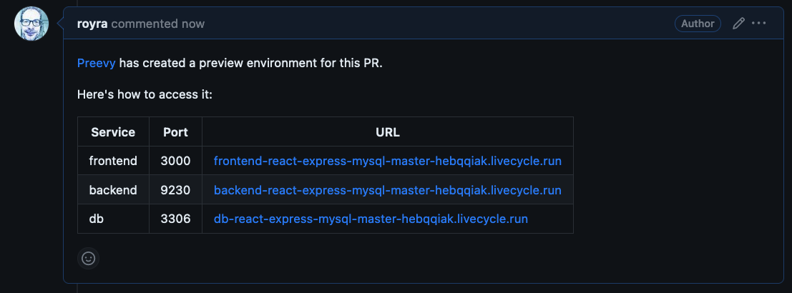

# GitHub Pull Request link

This plugin allows showing the Preevy environment URLs in a GitHub PR comment. The comment is added/updated at the `up` command and deleted in the `down` command.



## Configuration

Add the plugin to the `plugins` section of the `x-preevy` element in your Docker Compose file:

```yaml
services:
  ...
x-preevy:
  plugins:
    - module: '@preevy/plugin-github-pr-link'
    # detect: false
    # disabled: true
```

At runtime, the plugin will attempt to detect the configuration it needs from environment variables and the git context. Flags can be specified in the `up` and `down` commands to override the behaviour.

| | Environment variable | Flag | Other sources |
|---|------|------|-----|
| GitHub token | `GITHUB_TOKEN` | `--github-pr-link-token` | |
| Repo (username/reponame) | `GITHUB_REPOSITORY` | `--github-pr-link-repo` | git context |
| PR number | `GITHUB_REF` | `--github-pr-link-pr` | |

## CI providers

The plugin can auto detect its configuration from the CI providers supported by `@preevy/core`:

* [GitHub Actions](../core/src/ci-providers/github-actions.ts)
* [GitLab Actions](../core/src/ci-providers/gitlab.ts)
* [Circle CI](../core/src/ci-providers/circle.ts)
* [Travis CI](../core/src/ci-providers/travis.ts)
* [Azure Pipelines](../core/src/ci-providers/azure-pipelines.ts)

To disable auto-detection, specify `detect: false` at the plugin configuration in the Docker Compose file.

## Disabling the plugin

The plugin can be disabled by specifying `disabled: true` at the plugin configuration in the Docker Compose file, adding the environment variable `PREEVY_GITHUB_LINK=0` or specifying the flag `--github-pr-link-enabled=no` in the `up` and `down` commands.

