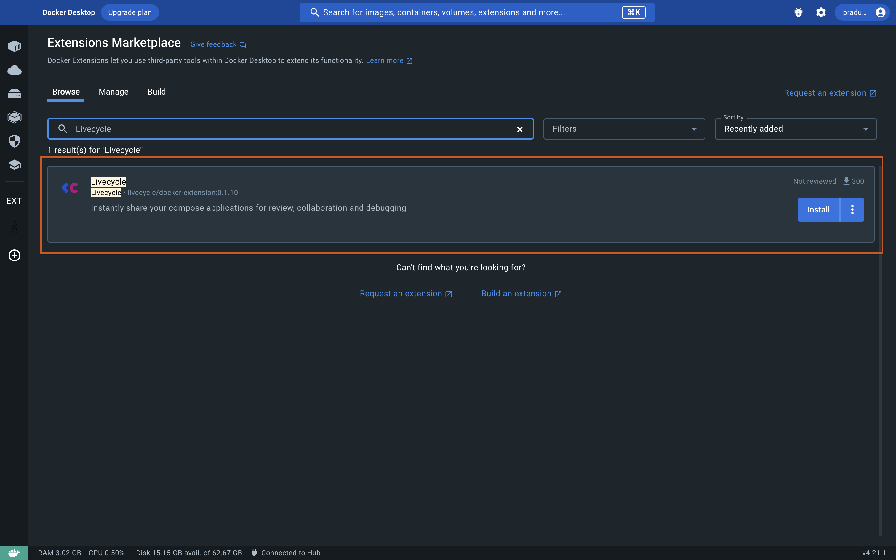
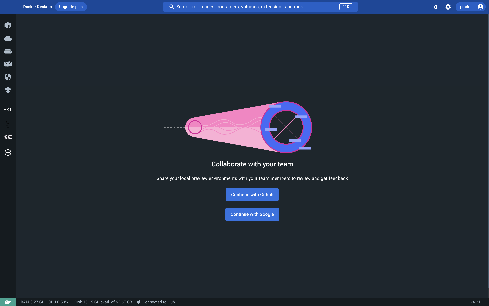
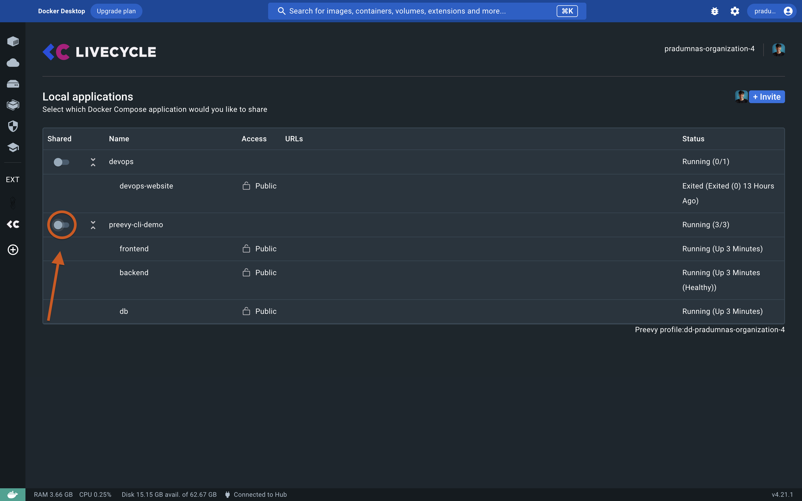
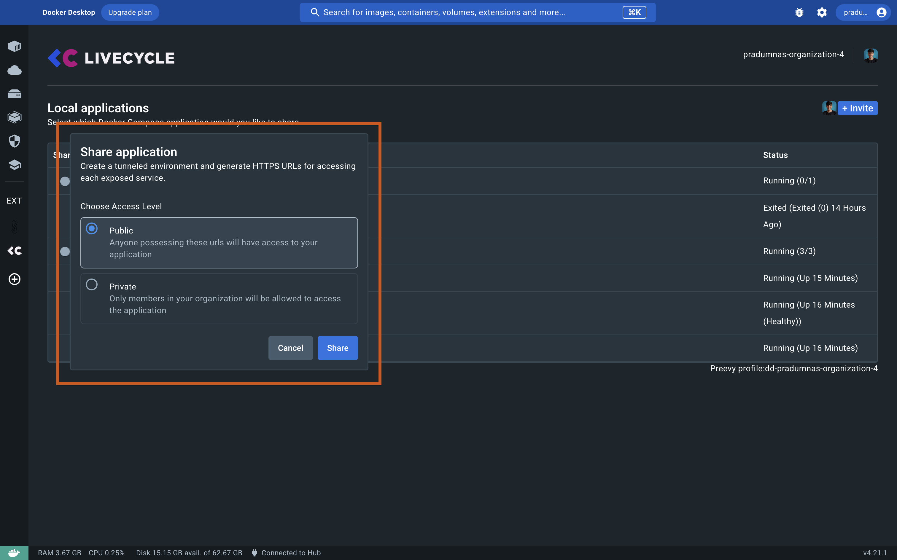
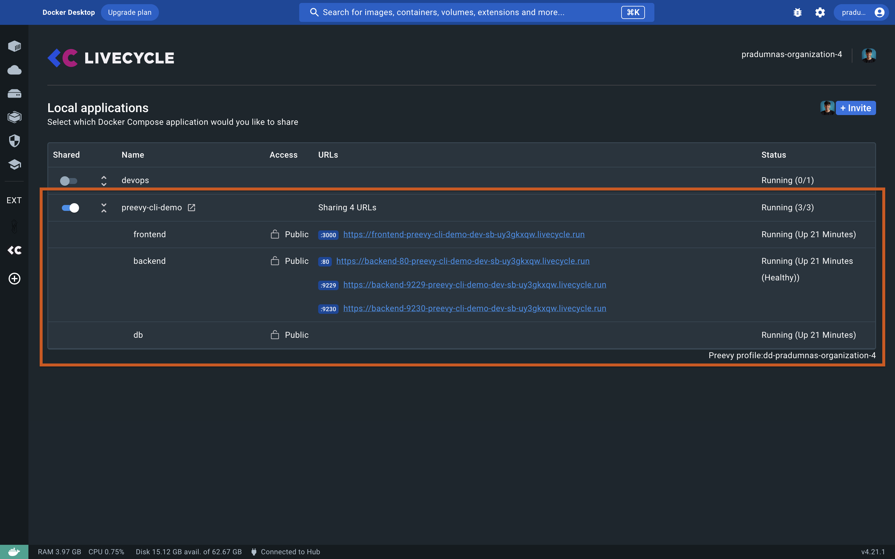
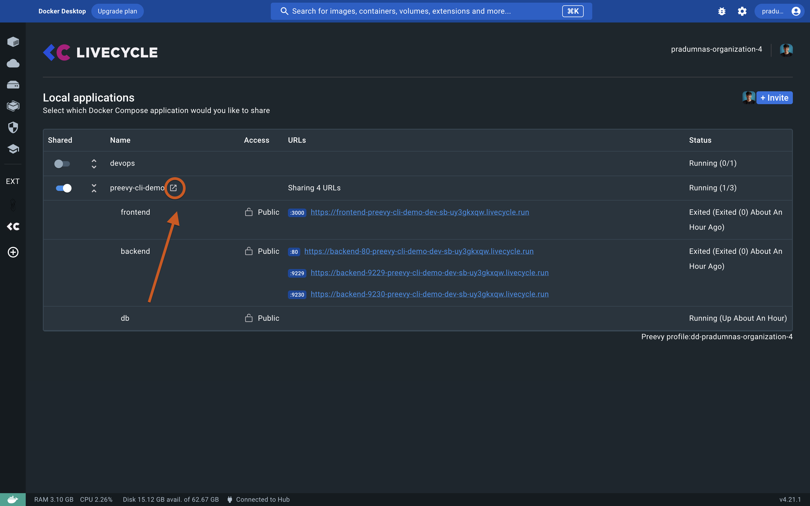
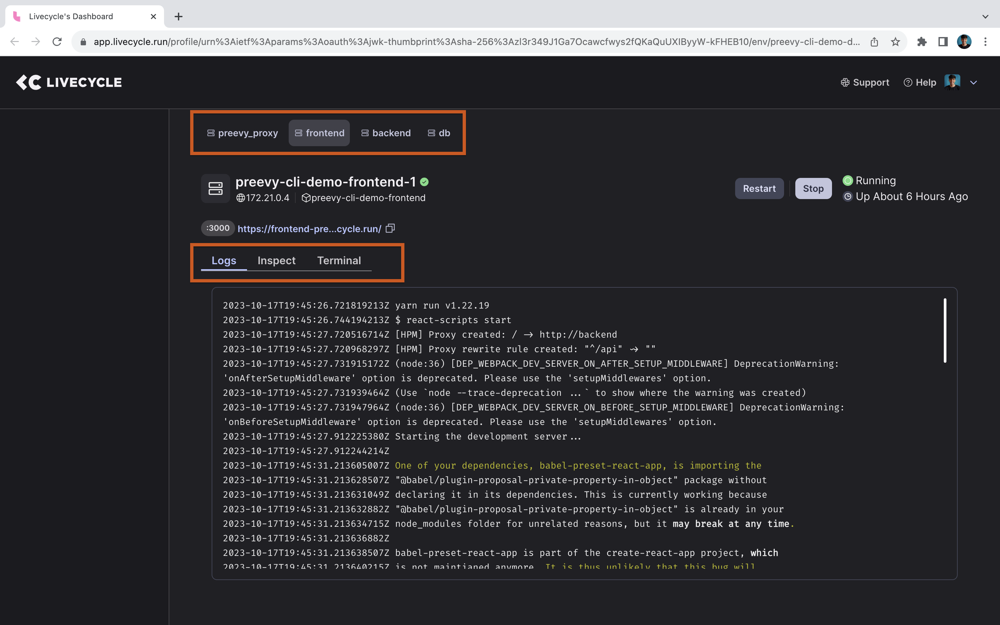

# Livecycle Docker Extension 🐳

## Overview

The Livecycle Docker Extension enables you to share your local development environment with your team, so you can get feedback much earlier in the development workflow, without the hassle of staging environments or CI builds.
The Livecycle Docker extension embeds a standalone version of the Preevy CLI, which provides all the network and collaboration capabilities. The extension creates a Preevy profile which can also be used to provision ephemeral environments.  

## Key Features

- Simple Docker for desktop UI
- Instant sharing of running applications/services:
  - Share HTTPS links so teammates can quickly access and review your web UI and backend services at runtime.
  - Instant, secure tunneling to frontend and backend services with [public or private access](https://preevy.dev/recipes/private-services). Access to private services can be restricted to your teammates' Google or GitHub accounts.
- Tools to debug your environment - log inspection, shell, and container inspection.
- Provision remote ephemeral environments using the Preevy CLI.

## Getting Started

### Prerequisites

- [Docker Desktop](https://www.docker.com/products/docker-desktop)

### Steps

1. **Installing the extension**

   Navigate to this [link](https://open.docker.com/extensions/marketplace?extensionId=livecycle/docker-extension) or search for "Livecycle" in the Docker Desktop Extensions Marketplace. Click the "Install" button to install the extension.

   

2. **Setting up a Livecycle account**

   Once you have installed the extension and opened it, you will be greeted with a login screen. You can choose to log in with your GitHub account or Google account. If you previously used Livecycle and created an organization, you can log in with your Livecycle account.

   

3. **Getting shareable URLs**
   
   As soon as you log in, you will be able to see a list of running docker compose applications and all the services that are running in them. To get a public shareable URL for every service, turn on the toggle next to the compose application name. After that, you will be prompted to choose the access level. 

   

   You can choose between public and private access. If you choose public access, you will get a public URL that you can share with anyone. If you choose private access, you will get a private URL that require authentication and can only be used by your organization members. Then click on the "Share" button to get the shareable URL.

   

4. **Accessing the shared URL**

   URLs created by the extension are consistent, shareable and can be used by a browser or any other http client.
   Using these URLs, your team members will be able to see and interact with your local version of the app as long as the tunnel is open your workstation is running.  
   Private environments require adding team members to your organization, and upon access, your team members will be prompted to authenticate.
   
   

5. **Accessing Livecycle dashboard**

   You can also access the Livecycle dashboard to see the logs and debug your application. Click on the "Open Link" button to open the Livecycle dashboard. On the dashboard, you can see all the running applications and services.
   The Livecycle dashboard requires authentication and organization membership, similiarly to private environments/services 

   

6. **Debugging, inspecting, and logging**

   Once you have opened the Livecycle dashboard, you can see all the environments/apps that are running. Click on the name of the environment for which you want to see the logs, terminal, etc. You can view the logs, terminal, and container inspection for each service.

   

That's it! You have successfully installed the Livecycle Docker Extension and shared your local development environment with your team.

## FAQ

  
What is the difference between the Livecycle Docker Extension and Ngrok?

  
  The Livecycle Docker Extension is integrated with Docker, and provides a smoother experience for Docker users.  
  Consistent URLs, private environments, organizations and Google/Github authentication are supported out of the box.  
  Livecycle dashboard provides debugging capabilites that includes log inspection, shell access, and container inspection.  
  Lastly, integration with the Preevy CLI allows you to create preview environments for Pull Requests - remote ephemeral environments that can be used when your development machine is offline.

  
Which frameworks and languages does Livecycle support?

  
  Livecycle is language and framework agnostic. It works with anything that runs in a Docker container.

  
What security features does the Livecycle Docker extension offer?

  
  The Livecycle Docker Extension uses a secure [SSH tunnel](https://livecycle.io/blogs/preevy-proxy-service-2/) to expose your local development environment using Livecycle's tunnel server, which is only accessible using HTTPS.  
  You can enable private URLs to restrict access to your environment.

  
How do I get started with the Livecycle Docker Extension?

  
  You can get started with the Livecycle Docker Extension by following the steps in the [Getting Started](#getting-started) section.

  
What makes the Livecycle Docker Extension different from other tools?

  
  Livecycle Docker extension is integrated with the Preevy CLI and the Livecycle managed service.
  Using the Preevy CLI, you can provision remote ephemeral environments that can be used in addtion to sharing local environments.  
  This functionality can also be used in your CI pipeline to provision preview environments for Pull Requests.  
  The Livecycle managed service adds additonal layers of management, collaboration, review and debugging on top of shared environments.  

  
How do I get support for the Livecycle Docker Extension?

  
  Join the [Livecycle Community](https://community.livecycle.io) on Slack to get support for the Livecycle Docker Extension.

