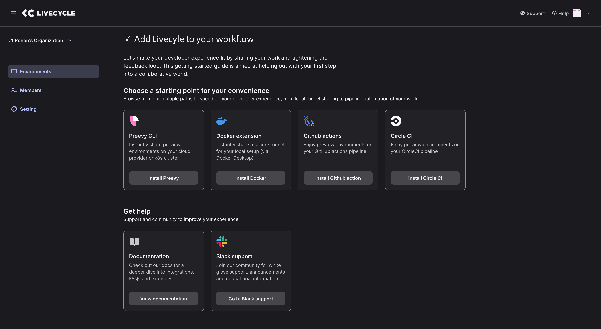

import { Logo } from "@site/src/components/Logo";
import LivecycleLogo from "./Livecycle_logo.png";

  <h1 style={{marginTop: "1.25rem", marginBottom: "0.25rem", lineHeight: "38px"}}>
    <Logo /> Preevy
  </h1>
  

    by <a href="https://livecycle.io">Livecycle</a>
  

  Easily Provision preview environments {" "}
  for Docker Compose applications 

Preevy is an open source tool from Livecycle designed to easily provision, manage, and expose ephemeral environments for containerized applications in the cloud.

These environments are inexpensive, easy to integrate, customizable, and accessible for both technical and non-technical users.

It’s simple, flexible, and doesn’t require deep DevOps knowledge, making it ideal for adding preview environments to your “pull/merge request” flows.

Read more about the Preevy [origin story and motivation](/intro/motivation).

 The Preevy CLI 

## About Livecycle

[Livecycle](https://livecycle.io/) is the dev-friendly Internal Developer Platform that speeds up review cycles by making it easy to share previews and collect feedback in context. 

Built on the “Preevy” open source engine, Livecycle provisions preview environments that contain built-in feedback tools so you can share changes and initiate collaborative reviews at any point in the SDLC. 

 Getting started with Livecycle 